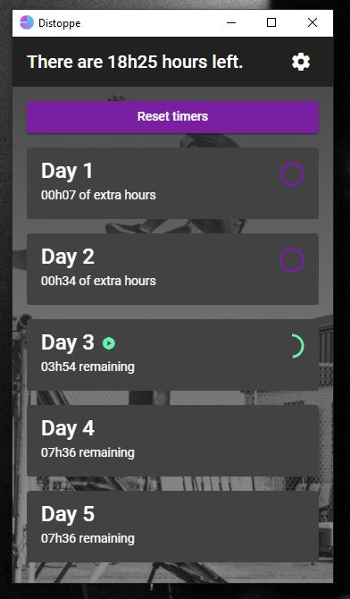

# Distoppe

Distoppe is a tracking working time application build over [Electronjs](https://https://www.electronjs.org) and [Angular](https://https://angular.io).

# Development

## Angular app

Run `ng serve` for development in the browser.

## Electronjs integration

Run `npm run build` for building the Angular app before run `npm run start-elec` for starting the Electronjs application.
